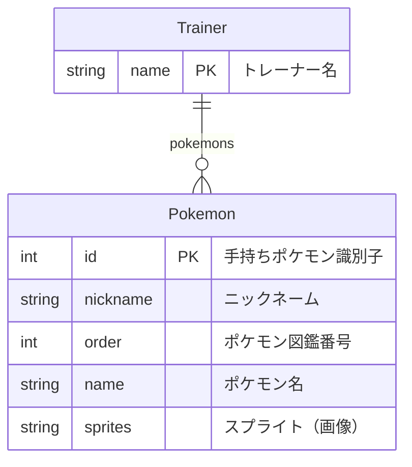

# 作業メモ
研修時に実施した開発作業内容を記録。

1. 準備

    * リポジトリ、ブランチの作成
      1. [lyceum-pokemon/skelton-start](https://github.com/webdino/lyceum-pokemon/tree/skeleton-start)のソースコードをzipダウンロードし、ローカルPCで解凍。
      1. 自アカウントにて新規リポジトリ(Pokemon-Simulator)を作成し、mainブランチをもとに[startブランチ](https://github.com/TacHub/Pokemon-Simulator/tree/start)を作成。
    * S3バケットの準備
      1. AWS S3にアクセスし、[km-sd22-pokemon](https://s3.console.aws.amazon.com/s3/buckets/km-sd22-pokemon?region=ap-northeast-1&bucketType=general&tab=objects)バケットを作成。トレーナーの情報はjsonファイルとしてS3に格納される。
    * インストールおよび環境設定ファイルの作成
      1. ```.env```ファイルを作成し、NUXT_BUCKET_NAMEとNUXT_REGIONを指定
      1. ```npm install```を実行
      1. ```npm i @aws-sdk/node-http-handler proxy-agent```のインストール
      1. ```npm run dev```でlocalhost:3000にアクセスできたことを確認。開発作業を開始。

2. 開発作業

    * サーバーサイド
      * ```server/utils/routers.js```
          * APIエンドポイントの定義、リクエストのハンドリングなど
      * ```server/utils/trainer.js```      
          * トレーナー・ポケモンに関するデータ操作(取得・追加・更新・削除)
    * フロントサイド
      * ```pages/index.vue```
          * 「はじめから」「つづきから」選択ページ
      * ```pages/new.bue```                 
          * 新規トレーナー作成ページ 
      * ```pages/trainer/index.vue```         
          * 既存トレーナー選択ページ
      * ```pages/trainer/[name]/catch.vue```  
          * ポケモンを捕獲するページ
      * ```pages/trainer/[name]/index.vue```  
          * トレーナーの情報、ポケモンの追加など

3. ビルド・デプロイ
    * 開発作業後、```npm run build``` を実行し、```nom start```でビルドしたサーバを起動し動作確認。
    * AWS AppRunnerを起動し、```ap-southeast-2```(シドニー)リージョンで[km-sd22_Pokemon-Simulator](https://ap-southeast-2.console.aws.amazon.com/apprunner/home?region=ap-southeast-2#/services/dashboard?service_arn=arn%3Aaws%3Aapprunner%3Aap-southeast-2%3A128411914028%3Aservice%2Fkm-sd22_Pokemon-Simulator%2F51d45ab268094621b47dac2b51d8c88f&active_tab=logs)というサービス名を作成
        * 設定
            * 設定ソース：```API```
            * ランタイム：```Nodejs 18```
            * 構築コマンド：```npm install; npm run build```
            * 開始コマンド：```npm start```
            * ポート：```3000```
            * 仮想CPUとメモリ：```0.25 vCPU & 0.5 GB```
            * インスタンスロール：```apprunner-have-s3fullaccess```
        * 環境変数
            * NUXT_BUKET_NAME：```km-sd-22-pokemon```
            * NUXT_REGION：```ap-northeast-1```

4. AWS上での挙動確認
AppRunner上で正常にデプロイされ、下記ドメインでアプリケーションにアクセスできたことを確認。

    * デフォルトドメイン：https://fpzqehhrpf.ap-southeast-2.awsapprunner.com/
    * ソースコード格納場所：https://github.com/TacHub/Pokemon-Simulator/tree/main


# lyceum-pokemon

ポケモン API を使った Nuxt+Express アプリ/サーバの開発演習

## つまったら

[ヒント集](docs/hints.md)を参照してください。それでも解消しなければ助けを求めましょう。

## 準備

- [AWS のセキュリティ認証情報](https://console.aws.amazon.com/iam/home#/security_credentials) にてアクセスキー ID とシークレットアクセスキーを生成してください
- [AWS S3](https://s3.console.aws.amazon.com/s3/buckets) にて空のバケットを作成してください (設定は全てデフォルトで大丈夫です)

## 実行環境

- Node Active LTS
- 本リポジトリをクローンし、次の使い方に従って実行してください
- 環境変数は実行環境 (ターミナルセッションなど) の環境変数に設定するか [.env ファイル](https://nuxt.com/docs/guide/directory-structure/env#env-file)を新規作成して記述してください

## 動作方法

### 開発時 Nuxt のみ起動

```bash
npm install # npm パッケージのインストール（初回のみ必須）
cat << EOL > .env # .env ファイルの作成（ターミナルに Bash 以外のシェルを使用している場合は適宜読み替えてください）
AWS_ACCESS_KEY_ID=XXXXXXXXXXXXXXXX
AWS_SECRET_ACCESS_KEY=xxxxxxxxxxxxxxxxxxxxxxxxxxxxxx
NUXT_BUCKET_NAME=<作成した S3 バケット名>
EOL
npm run dev # 開発サーバーの起動
```

### 開発時 Nuxt と Express 起動

```bash
npm install # npm パッケージのインストール（初回のみ必須）
cat << EOL > .env # .env ファイルの作成（ターミナルに Bash 以外のシェルを使用している場合は適宜読み替えてください）
AWS_ACCESS_KEY_ID=XXXXXXXXXXXXXXXX
AWS_SECRET_ACCESS_KEY=xxxxxxxxxxxxxxxxxxxxxxxxxxxxxx
NUXT_BUCKET_NAME=<作成した S3 バケット名>
NUXT_PUBLIC_BACKEND_ORIGIN=http://localhost:4000
EOL
npm run dev:express # 開発サーバーの起動
```

### App Runner へデプロイ

TBD

## npm スクリプト

次の npm スクリプトを用意しています (`package.json` の記述と `npm run` の出力を参照)。

- `npm install`: npm パッケージのインストール
- `npm run dev`: 開発サーバーの起動
- `npm run dev:express`: 開発サーバーの起動 (別プロセスでの Express サーバー起動を含む)
- `npm run build`: アプリケーションのプロダクションビルドを .output ディレクトリに生成する
- `npm start`: プロダクションビルドを使ったローカルサーバーの起動 (事前にビルドしておくこと)
- `npm run lint`: コードリント
- `npm run format`: コード整形

## 環境変数

| 変数名                       | 説明                                                                            | 初期値                    |
| :--------------------------- | :------------------------------------------------------------------------------ | :------------------------ |
| `AWS_ACCESS_KEY_ID`          | AWS 認証情報のアクセスキー ID                                                   | なし                      |
| `AWS_SECRET_ACCESS_KEY`      | AWS 認証情報のシークレットアクセスキー                                          | なし                      |
| `NUXT_REGION`                | AWS のリージョン                                                                | `"ap-northeast-1"`        |
| `NUXT_BUCKET_NAME`           | 本アプリケーションのデータ永続化に用いる AWS S3 バケット                        | `""`                      |
| `NUXT_PUBLIC_BACKEND_ORIGIN` | Nuxt から Express への API リクエストに用いるオリジン[^オリジン以外禁止]        | なし                      |
| `HOST` または `NITRO_HOST`   | `npm start` 時反映される Nuxt サーバーのホスト名                                | `"0.0.0.0"`               |
| `PORT` または `NITRO_PORT`   | `npm start` 時反映される Nuxt サーバーのポート番号                              | `3000`                    |
| `FRONTEND_ORIGIN`            | Express サーバが CORS を許可するアクセス元オリジン。Nuxt 側のオリジンを設定する | `"http://localhost:3000"` |
| `BACKEND_PORT`               | Express が HTTP(S) リクエストを受け付けるポート番号                             | `4000`                    |

[^オリジン以外禁止]: `NUXT_PUBLIC_BACKEND_ORIGIN` は末尾の `/` は入れないようにしてください。`npm run dev` の開発サーバでは問題無くとも `npm start` で本番環境を動かす場合などで 500 エラーになる場合があります。

### それぞれのケースで注意を払うべき環境変数の対応表

初期値がなくチェックがあるものについては、必ず自身で値を設定する必要があります。初期値があるものであっても、チェックがあるものについては自身で値を設定する必要がある場合があります。

| 変数名                                        | 開発時 Nuxt のみ起動 | 開発時 Nuxt と Express 起動 | App Runner へデプロイ |
| :-------------------------------------------- | :------------------- | :-------------------------- | :-------------------- |
| `AWS_ACCESS_KEY_ID` [^AWS_クレデンシャル]     | :heavy_check_mark:   | :heavy_check_mark:          |                       |
| `AWS_SECRET_ACCESS_KEY` [^AWS_クレデンシャル] | :heavy_check_mark:   | :heavy_check_mark:          |                       |
| `NUXT_REGION` [^他のリージョン]               |                      |                             |                       |
| `NUXT_BUCKET_NAME` [^AWS_S3_バケット名]       | :heavy_check_mark:   | :heavy_check_mark:          | :heavy_check_mark:    |
| `NUXT_PUBLIC_BACKEND_ORIGIN`                  |                      | :heavy_check_mark:          |                       |
| `HOST` または `NITRO_HOST`                    |                      |                             | :heavy_check_mark:    |
| `PORT` または `NITRO_PORT`                    |                      |                             | :heavy_check_mark:    |
| `FRONTEND_ORIGIN`                             |                      | :heavy_check_mark:          |                       |
| `BACKEND_PORT`                                |                      | :heavy_check_mark:          |                       |

[^AWS_クレデンシャル]: AWS SDK により認証情報が提供されている場合不要です。 https://docs.aws.amazon.com/ja_jp/sdk-for-javascript/v3/developer-guide/loading-node-credentials-shared.html
[^他のリージョン]: `"ap-northeast-1"` 以外のリージョンを使用している場合は設定必須です。
[^AWS_S3_バケット名]: AWS S3 バケット名はいずれの場合も設定必須です。`npm run build; npm start` でローカル起動する場合には特に OS 環境変数への設定が必須 (他と異なり `.env` ファイルが読まれない) ことに注意してください。

## クライアント画面構成

| 画面名               | 機能                                                                                                                   |
| :------------------- | :--------------------------------------------------------------------------------------------------------------------- |
| スタート             | 「つづきからはじめる」と「あたらしくはじめる」に遷移できる                                                             |
| あたらしくはじめる   | トレーナー名を入力してトレーナーが追加できる                                                                           |
| つづきからはじめる   | どのトレーナーを表示するか選択できる                                                                                   |
| トレーナー情報       | 「ポケモンをつかまえる」に遷移できる、ポケモンにニックネームをつけられる、ポケモンを削除できる、トレーナーを削除できる |
| ポケモンをつかまえる | ポケモンを追加できる                                                                                                   |

## ER 図



## サーバー API と AWS S3 の対応関係

| サーバー API             | AWS S3                          |
| :----------------------- | :------------------------------ |
| トレーナー名の一覧の取得 | S3 オブジェクトの一覧の取得     |
| トレーナーの追加         | S3 オブジェクトの追加または更新 |
| トレーナーの取得         | S3 オブジェクトの取得           |
| トレーナーの更新         | S3 オブジェクトの追加または更新 |
| トレーナーの削除         | S3 オブジェクトの削除           |
| ポケモンの追加           | S3 オブジェクトの追加または更新 |
| ポケモンの削除           | S3 オブジェクトの追加または更新 |

## S3 バケットに作成する S3 オブジェクトのサンプル

トレーナー情報 (トレーナーの名前や保有ポケモンのリスト) は AWS S3 のバケットの中に トレーナー名.json のような JSON ファイルとして保存します。
S3 バケット内のファイルリスト = トレーナーリストであり、トレーナーの情報は全てトレーナー名毎の JSON ファイルに含めています。

例えば、トレーナー名が `レッド` の場合は次のようになります:

- `レッド.json`: S3 オブジェクトキー（ファイル名）
- 次のコードブロック: S3 オブジェクト値（ファイル内容）

```json:レッド.json
{
  "name": "レッド",
  "pokemons": [
    {
      "id": 1,
      "nickname": "",
      "order": 35,
      "name": "pikachu",
      "sprites": {
        "front_default": "https://raw.githubusercontent.com/PokeAPI/sprites/master/sprites/pokemon/25.png"
      }
    },
    {
      "id": 2,
      "nickname": "",
      "order": 220,
      "name": "espeon",
      "sprites": {
        "front_default": "https://raw.githubusercontent.com/PokeAPI/sprites/master/sprites/pokemon/196.png"
      }
    }
  ]
}
```

## API エンドポイント

### GET `/api/trainers`

トレーナー名の一覧の取得

#### パラメーター

なし

#### レスポンス

##### 200

```json
["コジロウ", "サトシ", "ムサシ", "レッド"]
```

### POST `/api/trainer`

トレーナーの追加

#### パラメーター

なし

#### リクエストボディ

- `name`: トレーナー名（必須）
- `pokemons`: 手持ちポケモン（任意）

```json
{ "name": "satoshi" }
```

#### レスポンス

##### 200

[PutObjectCommandOutput](https://docs.aws.amazon.com/AWSJavaScriptSDK/v3/latest/clients/client-s3/interfaces/putobjectcommandoutput.html)

##### 400

空（リクエストボディに必要なプロパティが含まれていない場合に返される）

##### 409

空（すでにトレーナーが存在する場合に返される）

### GET `/api/trainer/:trainerName`

トレーナーの取得

#### パラメーター

- `trainerName`: トレーナー名

#### レスポンス

##### 200

```json
{ "name": "satoshi", "pokemons": [] }
```

### POST `/api/trainer/:trainerName`

トレーナーの更新

#### パラメーター

- `trainerName`: トレーナー名

#### リクエストボディ

- `name`: トレーナー名（必須）
- `pokemons`: 手持ちポケモン（任意）

```json
{ "name": "satoshi" }
```

#### レスポンス

##### 200

[PutObjectCommandOutput](https://docs.aws.amazon.com/AWSJavaScriptSDK/v3/latest/clients/client-s3/interfaces/putobjectcommandoutput.html)

##### 404

空（トレーナーが存在しない場合に返される）

### DELETE `/api/trainer/:trainerName`

トレーナーの削除

#### パラメーター

- `trainerName`: トレーナー名

#### レスポンス

##### 204

[DeleteObjectCommandOutput](https://docs.aws.amazon.com/AWSJavaScriptSDK/v3/latest/clients/client-s3/interfaces/deleteobjectcommandoutput.html)

### POST `/api/trainer/:trainerName/pokemon`

ポケモンの追加

#### パラメーター

- `trainerName`: トレーナー名

#### リクエストボディ

- `name`: ポケモン名（必須）

#### レスポンス

##### 200

[PutObjectCommandOutput](https://docs.aws.amazon.com/AWSJavaScriptSDK/v3/latest/clients/client-s3/interfaces/putobjectcommandoutput.html)

### DELETE `/api/trainer/:trainerName/pokemon/:pokemonId`

ポケモンの削除

#### パラメーター

- `trainerName`: トレーナー名
- `pokemonId`: 手持ちポケモン識別子

#### レスポンス

##### 200

[DeleteObjectCommandOutput](https://docs.aws.amazon.com/AWSJavaScriptSDK/v3/latest/clients/client-s3/interfaces/deleteobjectcommandoutput.html)
